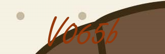

# 3-way-Encryption-and-decryption
#### This project is divided into 3 parts
1. Captcha generation
    * Creating random captcha
    
    * Writing the captcha onto the image
    
    * Generating a unique number from captcha to decide the co-ordinates for embedding

2. Encrypting
    * Taking the message from the user.
    * Encryting the message using AES with a password.
    * Converting the binary encoded message into the string for embedding.

3. Embedding
    * Converting the message into ascii format
    * Storing the message inside the image pixel color(r,g,b)
    
    As you can see there is no difference b/w the original and embedded image because we only manupilated with last few bits of the color.  

#### For Extracting the message.
- We input the embedded image
- We input the captcha for **Finding** the co-ordinates where message is embedded  
- We input the **Password** for decrypting the extracted message
- If there is any missmatch, the hidden message will not be extracted.

I will be much obliged if you would provide your valuable inputs. 
# Thank you. 